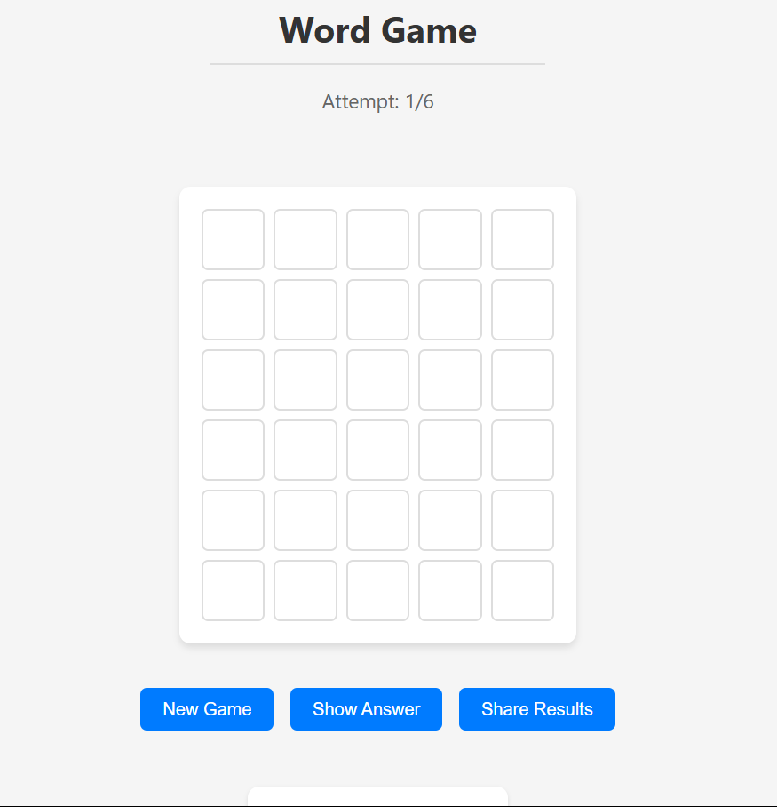
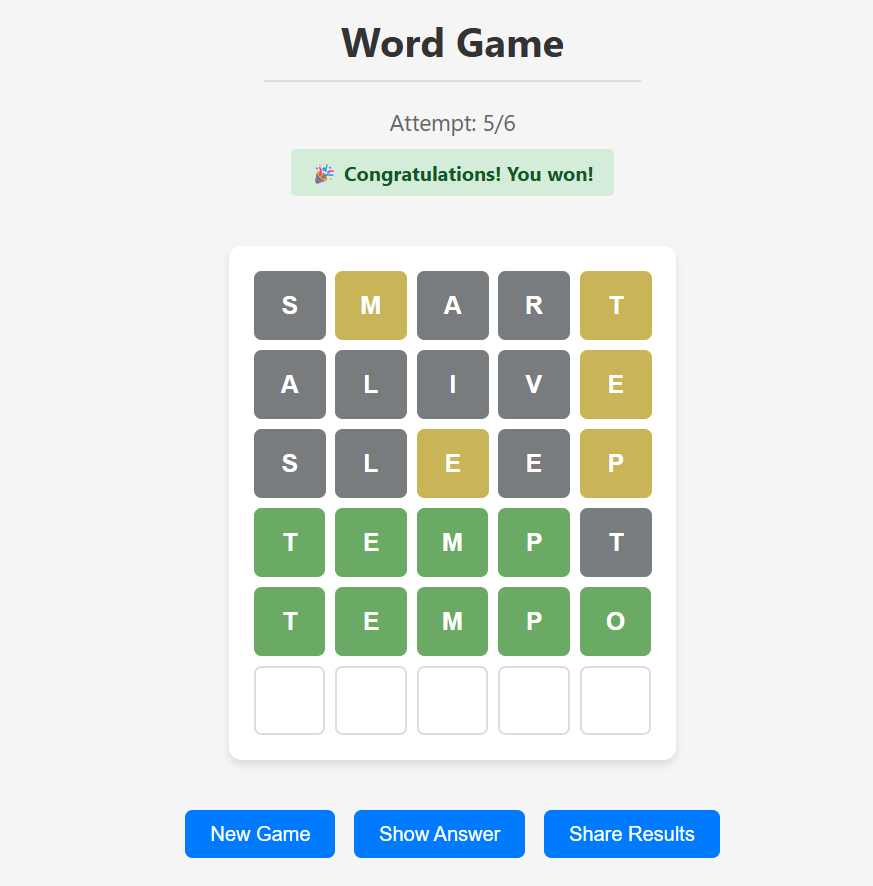
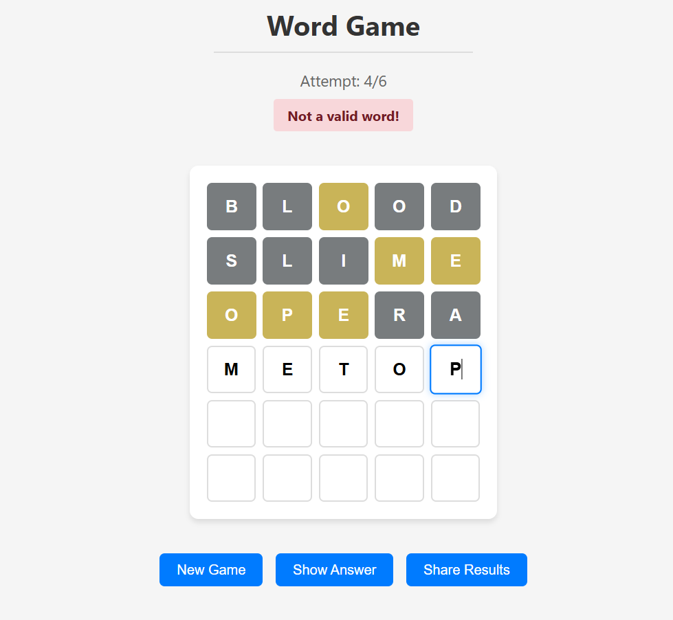
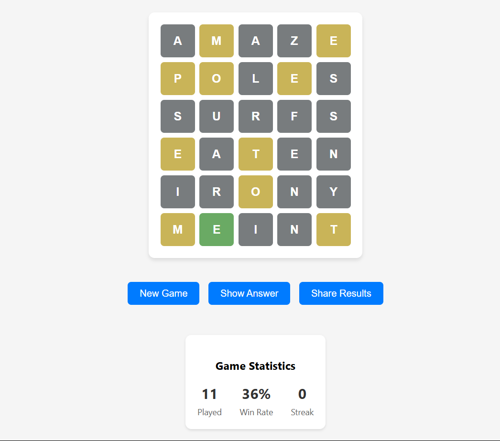

# Word Game

🎮 **[Play Live Demo](https://adamtoffic.github.io/word-game/)**

A clean, interactive word guessing game built with vanilla JavaScript, HTML, and CSS. Similar to Wordle, players have 6 attempts to guess a 5-letter word with color-coded feedback.

## Screenshots

<p align="center">
  
  
</p>
<p align="center">
  
  
</p>

## Features

- 🎯 6 attempts to guess the daily word
- 🎨 Color-coded feedback (Green: correct position, Yellow: wrong position, Gray: not in word)
- 📊 Game statistics tracking (games played, win rate, current streak)
- ⌨️ Keyboard shortcuts (Ctrl+R: new game, Ctrl+S: share results)
- 📱 Responsive design for mobile and desktop
- 🔄 Animated tile flips for better UX
- 📋 Share results functionality

## How to Play

1. Type a 5-letter word using your keyboard
2. Press Enter to submit your guess
3. Use the color feedback to guide your next guess:
   - 🟩 Green: Letter is correct and in the right position
   - 🟨 Yellow: Letter is in the word but wrong position
   - ⬛ Gray: Letter is not in the word
4. Guess the word within 6 attempts to win!

## Getting Started

### Prerequisites

- A modern web browser
- Internet connection (for fetching daily words)

### Installation

1. Clone the repository:
   ```bash
   git clone https://github.com/adamtoffic/word-game.git
   1. Navigate to the project directory:
   ```bash
   cd word-game
   ```
## Technologies Used
- HTML5 - Structures and semantics
- CSS3 - Styling and animations
- JavaScript - Game logic and interactivity
- Local Storage - Saving game state and statistics
- Fetch API - Word validation and daily word retrieval

## API
This game uses the following APIs provided by Frontend Masters:
-  **Word of the Day API**: Fetches the daily word to guess.
   - Endpoint: https://words.dev/api/word-of-the-day
-  **Word Validation API**: Validates if a guessed word is a valid 5-letter word.
   - Endpoint: https://words.dev/api/validate-word

## Contributing
Contributions are welcome! If you find a bug or have a feature request, please open an issue or submit a pull request.
   1. Fork the repository
   2. Create a feature branch:
   ```bash
   git checkout -b feature/your-feature-name
   ```
   3. Commit your changes:
   ```bash
   git commit -m "Add your feature description"
   ```
   4. Push to the branch:
   ```bash
   git push origin feature/your-feature-name
   ```
   5. Open a pull request
   
## License
This project is licensed under the MIT License - see the [LICENSE](LICENSE.txt) file for details

## Acknowledgements
- Inspired by the popular game Wordle
- Thanks to the Frontend Masters team for the API and inspiration
<hr></hr> Happy gaming! 🎉